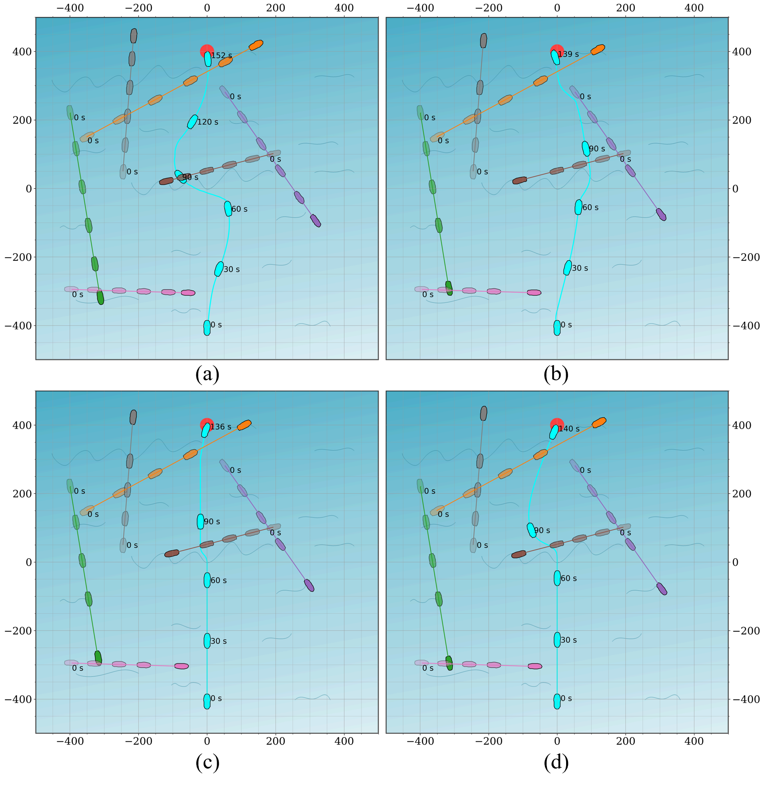

# USV_planner
Title: Local Collision Avoidance for Unmanned Surface Vehicles based on an End-to-End Planner with a LiDAR Beam Map

This paper has been submitted to IEEE Transactions on Intelligent Transportation Systems.

Proposed Beam map:


## Steps
1. Create a new environment

```powershell
conda create -n usv_planner python=3.8
```
2. Install dependencies

```powershell
pip install -r requirements.txt
```
3. Build and install RVO2

Follow the steps from the official [github](https://github.com/rebuttal-anonymous/Python-RVO2)

5. Start to train USV_planner with TD3 policy

```powershell
python main_TD3.py
```

## Device
Ubuntu 20.04.6

## Result 

### 1. Trajectory comparison between different algorithms. 
Comparison algorithms:(a)DDPG (b)TD3 (c)DWA (d)APF


### 2. Generalization ability verification.


## Acknowledgements
- The implementation of the beam map is inspired by the co-author [zw199502](https://github.com/zw199502/LSTM_EGO?tab=readme-ov-file#lstm_ego)'s code.

 - This project is based on [AntoineTheb](https://github.com/AntoineTheb/RNN-RL)'s implementation of the open-source solution of DRL structure.
 
 - The ORCA algorithm implementation is from [rebuttal-anonymous](https://github.com/rebuttal-anonymous/Python-RVO2)'s code.
 
 ## References:
 

> [1] W. Zhu and M. Hayashibe, "Learn to Navigate in Dynamic Environments with Normalized LiDAR Scans," 2024 IEEE International Conference on Robotics and Automation (ICRA), Yokohama, Japan, 2024, pp. 7568-7575, doi: 10.1109/ICRA57147.2024.10611247. 


